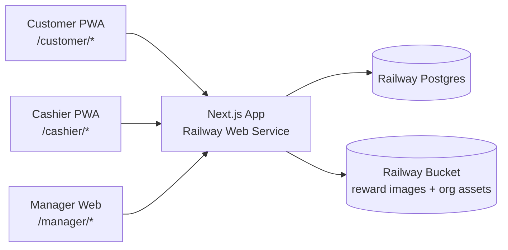

# Chotto Matcha Loyalty — Feature Handoff

Date: 2026-05-09
Status: demo build
Owner: Lesmon

## Stack

- Single Next.js (App Router) app, route prefixes per role: `/customer/*`, `/cashier/*`, `/manager/*`
- Railway Postgres + Drizzle ORM
- Railway volume-backed bucket/service for reward images and org assets
- better-auth for auth across all three roles
- shadcn/ui + Tailwind
- Hosted on Railway as one Next.js web service
- PWA manifests on customer + cashier routes

## Architecture

Keep the system intentionally small for v1: one app, one database, one private asset bucket.



### Railway services

- `web` — Next.js app, serves all customer, cashier, manager, API, auth, and image routes
- `postgres` — single Railway Postgres database for app data, auth tables, sessions, and transactions
- `bucket` — single Railway-hosted object/file storage target for uploaded reward images and org logo

### Request model

- Browser routes render through the same Next.js app.
- Server Actions/API route handlers perform all writes.
- Drizzle is the only database access layer.
- Uploaded files go through the Next.js app first, then into the bucket.
- Public image reads should go through a signed or proxied app route so the bucket can stay private.

### Deployment model

- One Railway project.
- One production environment to start.
- Optional preview environment later, but not required for demo.
- App deploys from the repo root once the Next.js scaffold exists.
- Database migrations run during deploy or as a manual Railway command before release.

### Runtime boundaries

- Customer and cashier routes are mobile/tablet PWA surfaces.
- Manager routes are desktop web surfaces.
- All role checks happen server-side before protected data is returned.
- Cashier PIN validates against hashed values in Postgres; it does not replace the branch/device auth session.

### Storage

- Store only asset metadata in Postgres: `bucket_key`, `filename`, `content_type`, `size`, `uploaded_by`, `created_at`.
- Store reward image references on `rewards.image_key`.
- Store org logo reference on `org_config.logo_key` or a typed settings table.
- Do not store uploaded image blobs in Postgres.
- Use one bucket namespace with prefixes:
    - `rewards/{reward_id}/image.{ext}`
    - `org/logo.{ext}`

### Environment variables

Local development values live in `.env.local`. Committable placeholders live in `.env.example`.

- `DATABASE_URL` — Railway Postgres connection string
- `BETTER_AUTH_SECRET` — auth signing secret
- `BETTER_AUTH_URL` — deployed app URL
- `APP_URL` — deployed app URL for email links and QR fallback URLs
- `BUCKET_ENDPOINT` — bucket endpoint or local service URL
- `BUCKET_ACCESS_KEY_ID` — bucket access key
- `BUCKET_SECRET_ACCESS_KEY` — bucket secret
- `BUCKET_NAME` — single bucket name
- `EMAIL_FROM` — sender address for auth codes and invites
- `EMAIL_PROVIDER_API_KEY` — provider key once email sending is wired

### Local development

- Run the Next.js app locally.
- Use Railway Postgres locally through `railway run` or a local Docker Postgres.
- Use local filesystem storage for bucket-compatible development if Railway bucket access is not set up yet.
- Keep storage behind a small adapter so the app can switch between local filesystem and Railway bucket without touching feature code.

## App scaffold

Suggested top-level shape once implementation starts:

```txt
app/
  (public)/
  customer/
  cashier/
  manager/
  api/
    auth/
    uploads/
components/
  customer/
  cashier/
  manager/
  shared/
db/
  schema.ts
  migrations/
  seed.ts
lib/
  auth/
  storage/
  points/
  roles/
  validators/
```

### Core server modules

- `lib/auth` — better-auth config, session helpers, role guards
- `lib/storage` — upload/read/delete adapter for the single bucket
- `lib/points` — earn/redeem/manual adjustment logic
- `lib/roles` — customer/cashier/manager authorization helpers
- `lib/validators` — shared Zod schemas for forms and API inputs

### Route ownership

- `/customer/*` — customer auth, points balance, QR, rewards, activity, profile
- `/cashier/*` — branch login, PIN session, scan/lookup, earn, redeem, recent transactions
- `/manager/*` — dashboard, rewards, branches, staff, customers, transactions, settings
- `/api/uploads/*` — authenticated upload and image-read endpoints

## Global rules

- Multi-branch from day 1 (seed 1–2 branches for demo)
- Earn rate: 1 point per ₱1 spent, stored as one org-level config value
- Points never expire
- Online-only (no offline queueing)
- Cashier is trusted (no receipt verification, no fraud checks)
- All cashier transactions stamp: customer_id, cashier_id, branch_id, timestamp, type (earn or redeem)
- Manager manual adjustments stamp: customer_id, manager_id, timestamp, type (manual), points_delta, reason

## Data model (high level)

- `customers` — id, email, name, phone, points_balance, created_at
- `branches` — id, name, address, active
- `staff` — id, email, name, role (cashier or manager), pin (cashier only, hashed), branch_id (cashier only), active
- `assets` — id, bucket_key, filename, content_type, size, uploaded_by, created_at
- `rewards` — id, name, description, image_asset_id, point_cost, type (item or merch), stock_count (nullable for unlimited), active
- `transactions` — id, customer_id, staff_id, branch_id, type (earn, redeem, manual), points_delta (+/-), bill_total (earn only), reward_id (redeem only), reason (manual only), created_at
- `org_config` — key/value (earn_rate, logo_asset_id, etc.)

## Customer app — `/customer/*`

PWA, mobile-first.

- [ ] Sign up with email + name → 6-digit code sent to email → verify → logged in
- [ ] Log in with email → 6-digit code → verified
- [ ] Session persists indefinitely on device
- [ ] Home: large points balance, "Show my QR" button, recent activity (last 10 transactions)
- [ ] My QR screen: full-screen QR encoding customer_id, brightness boost on display
- [ ] Rewards catalog: list of all active rewards, filter by type (all / items / merch), shows point cost, image, stock count if limited, "you need X more points" if not affordable
- [ ] Reward detail: image, description, cost, redeem instructions ("Show this at the counter")
- [ ] Activity history: paginated list of all earns and redemptions with date, branch, points delta
- [ ] Profile: name, email, phone, edit
- [ ] Install as PWA prompt
- [ ] Logout

## Cashier app — `/cashier/*`

PWA, tablet-optimized landscape layout.

- [ ] Branch login: email + password (one set of credentials per branch device)
- [ ] After branch login, cashier roster screen: tap your name, enter 4-digit PIN to start session
- [ ] Active session shows cashier name + branch in top bar, "End shift" button
- [ ] Customer identification:
    - [ ] Scan QR (uses tablet camera)
    - [ ] Manual phone number lookup fallback
- [ ] Customer found screen: name, current points balance, two action buttons → "Award points" or "Redeem reward"
- [ ] Award points flow: enter bill total in pesos → preview points to be awarded (bill × earn_rate) → confirm → success screen with new balance
- [ ] Redeem reward flow: list of rewards customer can afford (filter out unaffordable) → pick one → confirm (deduct points, decrement stock if tracked) → success screen "Hand over: [reward name]"
- [ ] Insufficient points state: show "Not enough points" if customer can't afford selected reward
- [ ] Out of stock state: hide or grey out rewards with stock_count = 0
- [ ] Recent transactions on this device: last 10 (for "oh I made a mistake" awareness — view only, not editable)
- [ ] Sign out cashier (returns to roster screen, branch stays logged in)

## Manager app — `/manager/*`

Web, desktop-first.

### Auth

- [ ] Email + password login (better-auth)
- [ ] Forgot password flow

### Dashboard (home)

- [ ] Total active customers
- [ ] Total points issued (all time + this month)
- [ ] Total points redeemed (all time + this month)
- [ ] Total redemptions count by reward (top 5)
- [ ] Per-branch breakdown of points issued / redeemed this month

### Reward catalog

- [ ] List all rewards (active + archived)
- [ ] Create reward: name, description, image upload, point cost, type (item or merch), stock count (optional)
- [ ] Edit reward
- [ ] Archive reward (soft delete — hide from customer/cashier views, preserve transaction history)
- [ ] Restore archived reward
- [ ] Adjust stock count manually

### Branches

- [ ] List branches
- [ ] Create branch: name, address
- [ ] Edit branch
- [ ] Deactivate branch (preserve history)

### Staff

- [ ] List staff (cashiers + managers)
- [ ] Create cashier: name, email, branch assignment, generate initial PIN
- [ ] Create manager: name, email, send invite
- [ ] Reset cashier PIN
- [ ] Reassign cashier to different branch
- [ ] Deactivate staff

### Customers

- [ ] Search by name / email / phone
- [ ] Customer detail: profile info, current balance, full transaction history
- [ ] Manual point adjustment: add or remove points with required reason note (logged as a transaction with type=manual, cashier_id=manager_id)

### Transactions

- [ ] Filterable list: date range, branch, type (earn / redeem / manual), customer
- [ ] Export filtered results to CSV
- [ ] Detail view per transaction

### Settings

- [ ] Edit earn rate (₱ per point)
- [ ] Org info (name, logo)

## Build order suggestion

1. Schema + migrations + seed (1 org, 2 branches, 1 manager, 2 cashiers, 5 rewards, 3 customers)
2. better-auth setup with three role flows
3. Customer app: signup/login → home → QR
4. Cashier app: branch login → cashier PIN → identify → award points
5. Reward catalog (manager + customer + cashier read)
6. Cashier redeem flow
7. Manager: customers, transactions, staff, branches
8. Manager: dashboard stats
9. PWA manifests + polish
10. Demo seed data + deploy

## Out of scope (v1)

- Push notifications, SMS, email receipts on earn/redeem
- Tier/status system
- Discount-style rewards (cash-equivalent)
- Pre-claim redemption codes
- Offline mode for cashier
- Marketing campaigns, point multipliers, broadcasts
- Low-stock alerts
- Receipt verification or cashier fraud checks
- Native iOS/Android apps
